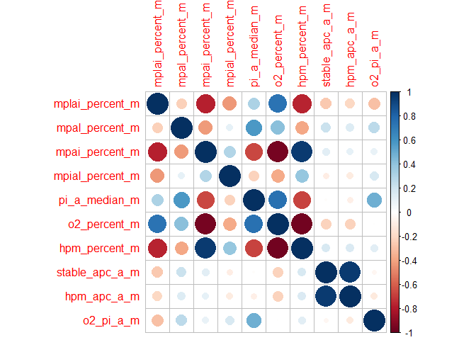

<!-- README.md is generated from README.Rmd. Please edit that file -->

# Joice-Lindsay

### Carregando Pacotes

``` r
library(tidyverse)
```

### Carregando as bases de dados individuas

``` r
casa <- readr::read_rds("data/casa.rds")
citomeria <- readr::read_rds("data/citomeria.rds")
morf_mot_vig <- readr::read_rds("data/morf_mot_vig.rds")
```

### Análise de Citomeria de Fluxo

``` r
cito_var <- names(citomeria[8:length(citomeria)])
for( i in seq_along(cito_var)){
  name_var <- cito_var[i]
  da <- citomeria %>% dplyr::select(grupo, coleta, touro, name_var)
  cat(" ====================== \n", name_var,"\n ====================== \n")
  names(da) <- c("grupo", "coleta", "touro", "y")
  da <- da %>% drop_na()
  grupo <- da %>%  pull(grupo)
  touro <- da %>%  pull(touro)
  coleta <- da %>%  pull(coleta)
  y <- da %>%  pull(y)
  ExpDes.pt::psub2.dic(grupo, coleta, touro,y,
                       sigF=.1, sigT = .1,
                       fac.names = c("grupo","coleta"))
}
#>  ====================== 
#>  fitc_a_median_t0 
#>  ====================== 
#> ------------------------------------------------------------------------
#> Legenda:
#> FATOR 1(parcela):  grupo 
#> FATOR 2 (subparcela):  coleta 
#> ------------------------------------------------------------------------
#> 
#> ------------------------------------------------------------------------
#> Quadro da analise de variancia
#> ------------------------------------------------------------------------
#>              GL      SQ     QM      Fc Pr(>Fc)    
#> grupo         1    1939   1939  0.0231  0.8816    
#> Erro a       13 1092753  84058                    
#> coleta        6 3921044 653507 16.8277  <2e-16 ***
#> grupo*coleta  6   99689  16615  0.4278  0.8581    
#> Erro b       72 2796143  38835                    
#> Total        98 7911569                           
#> ---
#> Signif. codes:  0 '***' 0.001 '**' 0.01 '*' 0.05 '.' 0.1 ' ' 1
#> ------------------------------------------------------------------------
#> CV 1 = 50.5723 %
#> CV 2 = 34.37454 %
#> 
#> ------------------------------------------------------------------------
#> #Teste de normalidade dos residuos (Shapiro-Wilk)
#> valor-p:  7.794493e-11 
#> ATENCAO: a 5% de significancia, os residuos nao podem ser considerados normais!
#> ------------------------------------------------------------------------
#> 
#> Interacao nao significativa: analisando os efeitos simples
#> ------------------------------------------------------------------------
#> grupo
#> De acordo com o teste F, as medias desse fator sao estatisticamente iguais.
#> ------------------------------------------------------------------------
#>   Niveis   Medias
#> 1      C 578.0435
#> 2      T 569.1698
#> ------------------------------------------------------------------------
#> coleta
#> Teste de Tukey
#> ------------------------------------------------------------------------
#> Grupos Tratamentos Medias
#> a     C6      823.8462 
#> ab    C4      792.6429 
#> abc   C3      710.2143 
#>  bc   C5      595.2 
#>   c   C2      520.6429 
#>    d      C0      309.7857 
#>    d      C1      296.8 
#> ------------------------------------------------------------------------
#> 
#>  ====================== 
#>  fitc_a_median_ttr 
#>  ====================== 
#> ------------------------------------------------------------------------
#> Legenda:
#> FATOR 1(parcela):  grupo 
#> FATOR 2 (subparcela):  coleta 
#> ------------------------------------------------------------------------
#> 
#> ------------------------------------------------------------------------
#> Quadro da analise de variancia
#> ------------------------------------------------------------------------
#>              GL      SQ     QM      Fc Pr(>Fc)    
#> grupo         1    1195   1195  0.0295  0.8663    
#> Erro a       13  526913  40532                    
#> coleta        6 3710948 618491 30.2680  <2e-16 ***
#> grupo*coleta  6  123052  20509  1.0037  0.4298    
#> Erro b       72 1471235  20434                    
#> Total        98 5833343                           
#> ---
#> Signif. codes:  0 '***' 0.001 '**' 0.01 '*' 0.05 '.' 0.1 ' ' 1
#> ------------------------------------------------------------------------
#> CV 1 = 32.20575 %
#> CV 2 = 22.86707 %
#> 
#> ------------------------------------------------------------------------
#> #Teste de normalidade dos residuos (Shapiro-Wilk)
#> valor-p:  0.0005119712 
#> ATENCAO: a 5% de significancia, os residuos nao podem ser considerados normais!
#> ------------------------------------------------------------------------
#> 
#> Interacao nao significativa: analisando os efeitos simples
#> ------------------------------------------------------------------------
#> grupo
#> De acordo com o teste F, as medias desse fator sao estatisticamente iguais.
#> ------------------------------------------------------------------------
#>   Niveis   Medias
#> 1      C 621.3913
#> 2      T 628.3585
#> ------------------------------------------------------------------------
#> coleta
#> Teste de Tukey
#> ------------------------------------------------------------------------
#> Grupos Tratamentos Medias
#> a     C4      837.6429 
#> a     C6      837.3846 
#> ab    C3      792.2143 
#>  b    C5      676 
#>   c   C2      525.7857 
#>   cd      C0      391.0714 
#>    d      C1      347.1333 
#> ------------------------------------------------------------------------
#> 
#>  ====================== 
#>  mplai_percent_0 
#>  ====================== 
#> ------------------------------------------------------------------------
#> Legenda:
#> FATOR 1(parcela):  grupo 
#> FATOR 2 (subparcela):  coleta 
#> ------------------------------------------------------------------------
#> 
#> ------------------------------------------------------------------------
#> Quadro da analise de variancia
#> ------------------------------------------------------------------------
#>              GL      SQ     QM     Fc  Pr(>Fc)   
#> grupo         1   476.7 476.72 0.9377 0.350552   
#> Erro a       13  6609.4 508.42                   
#> coleta        6  5101.1 850.19 3.9883 0.001678 **
#> grupo*coleta  6   792.5 132.08 0.6196 0.713953   
#> Erro b       72 15348.3 213.17                   
#> Total        98 28328.1                          
#> ---
#> Signif. codes:  0 '***' 0.001 '**' 0.01 '*' 0.05 '.' 0.1 ' ' 1
#> ------------------------------------------------------------------------
#> CV 1 = 56.24944 %
#> CV 2 = 36.4228 %
#> 
#> ------------------------------------------------------------------------
#> #Teste de normalidade dos residuos (Shapiro-Wilk)
#> valor-p:  0.002173795 
#> ATENCAO: a 5% de significancia, os residuos nao podem ser considerados normais!
#> ------------------------------------------------------------------------
#> 
#> Interacao nao significativa: analisando os efeitos simples
#> ------------------------------------------------------------------------
#> grupo
#> De acordo com o teste F, as medias desse fator sao estatisticamente iguais.
#> ------------------------------------------------------------------------
#>   Niveis   Medias
#> 1      C 42.44130
#> 2      T 38.04151
#> ------------------------------------------------------------------------
#> coleta
#> Teste de Tukey
#> ------------------------------------------------------------------------
#> Grupos Tratamentos Medias
#> a     C0      51.62143 
#> ab    C3      47.8 
#> abc   C5      41.99333 
#> abc   C2      38.83571 
#> abc   C4      37.50714 
#>  bc   C6      34.18462 
#>   c   C1      28.9 
#> ------------------------------------------------------------------------
#> 
#>  ====================== 
#>  mpal_percent_0 
#>  ====================== 
#> ------------------------------------------------------------------------
#> Legenda:
#> FATOR 1(parcela):  grupo 
#> FATOR 2 (subparcela):  coleta 
#> ------------------------------------------------------------------------
#> 
#> ------------------------------------------------------------------------
#> Quadro da analise de variancia
#> ------------------------------------------------------------------------
#>              GL     SQ     QM     Fc Pr(>Fc)    
#> grupo         1   65.9  65.91 1.0137 0.33239    
#> Erro a       13  845.2  65.01                   
#> coleta        6 2028.1 338.02 9.0551 < 2e-16 ***
#> grupo*coleta  6  434.2  72.37 1.9386 0.08607 .  
#> Erro b       72 2687.7  37.33                   
#> Total        98 6061.1                          
#> ---
#> Signif. codes:  0 '***' 0.001 '**' 0.01 '*' 0.05 '.' 0.1 ' ' 1
#> ------------------------------------------------------------------------
#> CV 1 = 86.07446 %
#> CV 2 = 65.22147 %
#> 
#> ------------------------------------------------------------------------
#> #Teste de normalidade dos residuos (Shapiro-Wilk)
#> valor-p:  0.01290949 
#> ATENCAO: a 5% de significancia, os residuos nao podem ser considerados normais!
#> ------------------------------------------------------------------------
#> 
#> 
#> 
#> Interacao significativa: desdobrando a interacao
#> ------------------------------------------------------------------------
#> 
#> Desdobrando  grupo  dentro de cada nivel de  coleta 
#> ------------------------------------------------------------------------
#>                          GL          SQ         QM       Fc  valor.p
#> grupo : coleta C0   1.00000  137.657857 137.657857 3.334411 0.071497
#> grupo : coleta C1   1.00000   53.655625  53.655625 1.299671 0.257603
#> grupo : coleta C2   1.00000    2.560000   2.560000 0.062009 0.803972
#> grupo : coleta C3   1.00000   46.082857  46.082857  1.11624 0.293843
#> grupo : coleta C4   1.00000   18.922500  18.922500 0.458349 0.500308
#> grupo : coleta C5   1.00000    1.562500   1.562500 0.037848 0.846232
#> grupo : coleta C6   1.00000    9.945714   9.945714  0.24091 0.624865
#> Erro combinado     81.72669 3374.005526  41.284013                  
#> ------------------------------------------------------------------------
#> 
#> 
#>  grupo dentro de coleta C0
#> ------------------------------------------------------------------------
#> Teste de Tukey
#> ------------------------------------------------------------------------
#> Grupos Tratamentos Medias
#> a     T   11.95714 
#>  b    C   5.685714 
#> ------------------------------------------------------------------------
#> 
#>  grupo dentro de coleta C1
#> ------------------------------------------------------------------------
#> De acordo com o teste F, as medias desse fator sao estatisticamente iguais.
#> ------------------------------------------------------------------------
#>   Niveis   Medias
#> 1      C 16.11429
#> 2      T 10.43750
#> ------------------------------------------------------------------------
#> 
#>  grupo dentro de coleta C2
#> ------------------------------------------------------------------------
#> De acordo com o teste F, as medias desse fator sao estatisticamente iguais.
#> ------------------------------------------------------------------------
#>   Niveis   Medias
#> 1      C 7.133333
#> 2      T 6.150000
#> ------------------------------------------------------------------------
#> 
#>  grupo dentro de coleta C3
#> ------------------------------------------------------------------------
#> De acordo com o teste F, as medias desse fator sao estatisticamente iguais.
#> ------------------------------------------------------------------------
#>   Niveis    Medias
#> 1      C 10.242857
#> 2      T  6.614286
#> ------------------------------------------------------------------------
#> 
#>  grupo dentro de coleta C4
#> ------------------------------------------------------------------------
#> De acordo com o teste F, as medias desse fator sao estatisticamente iguais.
#> ------------------------------------------------------------------------
#>   Niveis   Medias
#> 1      C 21.91667
#> 2      T 14.26250
#> ------------------------------------------------------------------------
#> 
#>  grupo dentro de coleta C5
#> ------------------------------------------------------------------------
#> De acordo com o teste F, as medias desse fator sao estatisticamente iguais.
#> ------------------------------------------------------------------------
#>   Niveis   Medias
#> 1      C 2.842857
#> 2      T 1.862500
#> ------------------------------------------------------------------------
#> 
#>  grupo dentro de coleta C6
#> ------------------------------------------------------------------------
#> De acordo com o teste F, as medias desse fator sao estatisticamente iguais.
#> ------------------------------------------------------------------------
#>   Niveis   Medias
#> 1      C 8.783333
#> 2      T 9.214286
#> ------------------------------------------------------------------------
#> 
#> 
#> Desdobrando  coleta  dentro de cada nivel de  grupo 
#> ------------------------------------------------------------------------
#>                   GL        SQ        QM       Fc  valor.p
#> coleta : grupo C   6 1671.2781 278.54635 7.461954    3e-06
#> coleta : grupo T   6  887.4478 147.90796 3.962293 0.001764
#> Erro b            72 2687.6792  37.32888                  
#> ------------------------------------------------------------------------
#> 
#> 
#>  coleta dentro de grupo C
#> ------------------------------------------------------------------------
#> Teste de Tukey
#> ------------------------------------------------------------------------
#> Grupos Tratamentos Medias
#> a     C4      21.91667 
#> ab    C1      16.11429 
#>  bc   C3      10.24286 
#>  bc   C6      8.783333 
#>  bc   C2      7.133333 
#>   c   C0      5.685714 
#>   c   C5      2.842857 
#> ------------------------------------------------------------------------
#> ------------------------------------------------------------------------
#> 
#> 
#>  coleta dentro de grupo T
#> ------------------------------------------------------------------------
#> Teste de Tukey
#> ------------------------------------------------------------------------
#> Grupos Tratamentos Medias
#> a     C4      14.2625 
#> a     C0      11.95714 
#> ab    C1      10.4375 
#> ab    C6      9.214286 
#> ab    C3      6.614286 
#> ab    C2      6.15 
#>  b    C5      1.8625 
#> ------------------------------------------------------------------------
#> ------------------------------------------------------------------------
#> 
#>  ====================== 
#>  mpai_percent_0 
#>  ====================== 
#> ------------------------------------------------------------------------
#> Legenda:
#> FATOR 1(parcela):  grupo 
#> FATOR 2 (subparcela):  coleta 
#> ------------------------------------------------------------------------
#> 
#> ------------------------------------------------------------------------
#> Quadro da analise de variancia
#> ------------------------------------------------------------------------
#>              GL      SQ     QM     Fc  Pr(>Fc)   
#> grupo         1   871.7 871.70 1.6158 0.225947   
#> Erro a       13  7013.1 539.47                   
#> coleta        6  4746.4 791.07 3.7687 0.002558 **
#> grupo*coleta  6   794.4 132.39 0.6307 0.705160   
#> Erro b       72 15113.2 209.91                   
#> Total        98 28538.8                          
#> ---
#> Signif. codes:  0 '***' 0.001 '**' 0.01 '*' 0.05 '.' 0.1 ' ' 1
#> ------------------------------------------------------------------------
#> CV 1 = 46.61686 %
#> CV 2 = 29.07847 %
#> 
#> ------------------------------------------------------------------------
#> #Teste de normalidade dos residuos (Shapiro-Wilk)
#> valor-p:  0.05305607 
#> De acordo com o teste de Shapiro-Wilk a 5% de significancia, os residuos podem ser considerados normais.
#> ------------------------------------------------------------------------
#> 
#> Interacao nao significativa: analisando os efeitos simples
#> ------------------------------------------------------------------------
#> grupo
#> De acordo com o teste F, as medias desse fator sao estatisticamente iguais.
#> ------------------------------------------------------------------------
#>   Niveis   Medias
#> 1      C 46.63913
#> 2      T 52.58868
#> ------------------------------------------------------------------------
#> coleta
#> Teste de Tukey
#> ------------------------------------------------------------------------
#> Grupos Tratamentos Medias
#> a     C1      56.68667 
#> a     C6      56.33846 
#> a     C5      55.59333 
#> a     C2      53.69286 
#> ab    C4      44.20714 
#> ab    C3      43.57857 
#>  b    C0      38.23571 
#> ------------------------------------------------------------------------
#> 
#>  ====================== 
#>  mpial_percent_0 
#>  ====================== 
#> ------------------------------------------------------------------------
#> Legenda:
#> FATOR 1(parcela):  grupo 
#> FATOR 2 (subparcela):  coleta 
#> ------------------------------------------------------------------------
#> 
#> ------------------------------------------------------------------------
#> Quadro da analise de variancia
#> ------------------------------------------------------------------------
#>              GL      SQ     QM     Fc  Pr(>Fc)   
#> grupo         1   0.284 0.2838 0.2062 0.657273   
#> Erro a       13  17.892 1.3763                   
#> coleta        6  21.967 3.6612 4.1010 0.001353 **
#> grupo*coleta  6   0.554 0.0923 0.1034 0.995794   
#> Erro b       72  64.278 0.8927                   
#> Total        98 104.974                          
#> ---
#> Signif. codes:  0 '***' 0.001 '**' 0.01 '*' 0.05 '.' 0.1 ' ' 1
#> ------------------------------------------------------------------------
#> CV 1 = 163.8112 %
#> CV 2 = 131.9329 %
#> 
#> ------------------------------------------------------------------------
#> #Teste de normalidade dos residuos (Shapiro-Wilk)
#> valor-p:  2.874764e-12 
#> ATENCAO: a 5% de significancia, os residuos nao podem ser considerados normais!
#> ------------------------------------------------------------------------
#> 
#> Interacao nao significativa: analisando os efeitos simples
#> ------------------------------------------------------------------------
#> grupo
#> De acordo com o teste F, as medias desse fator sao estatisticamente iguais.
#> ------------------------------------------------------------------------
#>   Niveis    Medias
#> 1      C 0.6586957
#> 2      T 0.7660377
#> ------------------------------------------------------------------------
#> coleta
#> Teste de Tukey
#> ------------------------------------------------------------------------
#> Grupos Tratamentos Medias
#> a     C1      1.333333 
#> a     C0      1.314286 
#> ab    C2      0.8714286 
#> ab    C4      0.75 
#> ab    C6      0.4615385 
#>  b    C3      0.2 
#>  b    C5      0.06666667 
#> ------------------------------------------------------------------------
#> 
#>  ====================== 
#>  mplai_percent_4 
#>  ====================== 
#> ------------------------------------------------------------------------
#> Legenda:
#> FATOR 1(parcela):  grupo 
#> FATOR 2 (subparcela):  coleta 
#> ------------------------------------------------------------------------
#> 
#> ------------------------------------------------------------------------
#> Quadro da analise de variancia
#> ------------------------------------------------------------------------
#>              GL      SQ     QM     Fc  Pr(>Fc)   
#> grupo         1   153.6 153.62 0.2924 0.597851   
#> Erro a       13  6830.5 525.42                   
#> coleta        6  4283.2 713.87 3.4733 0.004522 **
#> grupo*coleta  6  1165.8 194.31 0.9454 0.468345   
#> Erro b       72 14798.4 205.53                   
#> Total        98 27231.6                          
#> ---
#> Signif. codes:  0 '***' 0.001 '**' 0.01 '*' 0.05 '.' 0.1 ' ' 1
#> ------------------------------------------------------------------------
#> CV 1 = 66.96434 %
#> CV 2 = 41.88226 %
#> 
#> ------------------------------------------------------------------------
#> #Teste de normalidade dos residuos (Shapiro-Wilk)
#> valor-p:  0.0002506846 
#> ATENCAO: a 5% de significancia, os residuos nao podem ser considerados normais!
#> ------------------------------------------------------------------------
#> 
#> Interacao nao significativa: analisando os efeitos simples
#> ------------------------------------------------------------------------
#> grupo
#> De acordo com o teste F, as medias desse fator sao estatisticamente iguais.
#> ------------------------------------------------------------------------
#>   Niveis   Medias
#> 1      C 35.56739
#> 2      T 33.06981
#> ------------------------------------------------------------------------
#> coleta
#> Teste de Tukey
#> ------------------------------------------------------------------------
#> Grupos Tratamentos Medias
#> a     C0      45.47143 
#> ab    C3      41.6 
#> abc   C2      37 
#>  bc   C1      30.48 
#>  bc   C5      29.86 
#>  bc   C6      28.82308 
#>   c   C4      26.57143 
#> ------------------------------------------------------------------------
#> 
#>  ====================== 
#>  mpal_percent_4 
#>  ====================== 
#> ------------------------------------------------------------------------
#> Legenda:
#> FATOR 1(parcela):  grupo 
#> FATOR 2 (subparcela):  coleta 
#> ------------------------------------------------------------------------
#> 
#> ------------------------------------------------------------------------
#> Quadro da analise de variancia
#> ------------------------------------------------------------------------
#>              GL      SQ     QM     Fc Pr(>Fc)    
#> grupo         1    78.4  78.43 0.2505  0.6251    
#> Erro a       13  4070.2 313.09                   
#> coleta        6  5289.1 881.52 8.7666  <2e-16 ***
#> grupo*coleta  6   219.5  36.59 0.3639  0.8994    
#> Erro b       71  7139.3 100.55                   
#> Total        97 16796.6                          
#> ---
#> Signif. codes:  0 '***' 0.001 '**' 0.01 '*' 0.05 '.' 0.1 ' ' 1
#> ------------------------------------------------------------------------
#> CV 1 = 78.21613 %
#> CV 2 = 44.32607 %
#> 
#> ------------------------------------------------------------------------
#> #Teste de normalidade dos residuos (Shapiro-Wilk)
#> valor-p:  0.6396488 
#> De acordo com o teste de Shapiro-Wilk a 5% de significancia, os residuos podem ser considerados normais.
#> ------------------------------------------------------------------------
#> 
#> Interacao nao significativa: analisando os efeitos simples
#> ------------------------------------------------------------------------
#> grupo
#> De acordo com o teste F, as medias desse fator sao estatisticamente iguais.
#> ------------------------------------------------------------------------
#>   Niveis   Medias
#> 1      C 23.59333
#> 2      T 21.79811
#> ------------------------------------------------------------------------
#> coleta
#> Teste de Tukey
#> ------------------------------------------------------------------------
#> Grupos Tratamentos Medias
#> a     C4      37 
#> ab    C3      29.86429 
#>  bc   C0      22.56429 
#>  bc   C6      20.59231 
#>   c   C1      19.20667 
#>   c   C5      17.11333 
#>   c   C2      13.53571 
#> ------------------------------------------------------------------------
#> 
#>  ====================== 
#>  mpai_percent_4 
#>  ====================== 
#> ------------------------------------------------------------------------
#> Legenda:
#> FATOR 1(parcela):  grupo 
#> FATOR 2 (subparcela):  coleta 
#> ------------------------------------------------------------------------
#> 
#> ------------------------------------------------------------------------
#> Quadro da analise de variancia
#> ------------------------------------------------------------------------
#>              GL    SQ      QM     Fc Pr(>Fc)    
#> grupo         1   504  504.49 0.7297  0.4085    
#> Erro a       13  8988  691.38                   
#> coleta        6  8863 1477.09 7.0704   6e-06 ***
#> grupo*coleta  6   889  148.21 0.7094  0.6431    
#> Erro b       72 15042  208.91                   
#> Total        98 34286                           
#> ---
#> Signif. codes:  0 '***' 0.001 '**' 0.01 '*' 0.05 '.' 0.1 ' ' 1
#> ------------------------------------------------------------------------
#> CV 1 = 62.41908 %
#> CV 2 = 34.31155 %
#> 
#> ------------------------------------------------------------------------
#> #Teste de normalidade dos residuos (Shapiro-Wilk)
#> valor-p:  0.1705818 
#> De acordo com o teste de Shapiro-Wilk a 5% de significancia, os residuos podem ser considerados normais.
#> ------------------------------------------------------------------------
#> 
#> Interacao nao significativa: analisando os efeitos simples
#> ------------------------------------------------------------------------
#> grupo
#> De acordo com o teste F, as medias desse fator sao estatisticamente iguais.
#> ------------------------------------------------------------------------
#>   Niveis   Medias
#> 1      C 39.70217
#> 2      T 44.22830
#> ------------------------------------------------------------------------
#> coleta
#> Teste de Tukey
#> ------------------------------------------------------------------------
#> Grupos Tratamentos Medias
#> a     C5      52.11333 
#> ab    C6      50.14615 
#> ab    C1      49.24667 
#> ab    C2      48.62857 
#>  bc   C4      35.7 
#>   c   C0      30.15 
#>   c   C3      28.24286 
#> ------------------------------------------------------------------------
#> 
#>  ====================== 
#>  mpial_percent_4 
#>  ====================== 
#> ------------------------------------------------------------------------
#> Legenda:
#> FATOR 1(parcela):  grupo 
#> FATOR 2 (subparcela):  coleta 
#> ------------------------------------------------------------------------
#> 
#> ------------------------------------------------------------------------
#> Quadro da analise de variancia
#> ------------------------------------------------------------------------
#>              GL      SQ     QM      Fc Pr(>Fc)  
#> grupo         1   0.036 0.0363 0.01950  0.8911  
#> Erro a       13  24.201 1.8616                  
#> coleta        6  19.556 3.2593 2.90826  0.0135 *
#> grupo*coleta  6   4.053 0.6755 0.60278  0.7272  
#> Erro b       72  80.690 1.1207                  
#> Total        98 128.536                         
#> ---
#> Signif. codes:  0 '***' 0.001 '**' 0.01 '*' 0.05 '.' 0.1 ' ' 1
#> ------------------------------------------------------------------------
#> CV 1 = 156.3398 %
#> CV 2 = 121.3011 %
#> 
#> ------------------------------------------------------------------------
#> #Teste de normalidade dos residuos (Shapiro-Wilk)
#> valor-p:  1.61038e-11 
#> ATENCAO: a 5% de significancia, os residuos nao podem ser considerados normais!
#> ------------------------------------------------------------------------
#> 
#> Interacao nao significativa: analisando os efeitos simples
#> ------------------------------------------------------------------------
#> grupo
#> De acordo com o teste F, as medias desse fator sao estatisticamente iguais.
#> ------------------------------------------------------------------------
#>   Niveis    Medias
#> 1      C 0.8521739
#> 2      T 0.8905660
#> ------------------------------------------------------------------------
#> coleta
#> Teste de Tukey
#> ------------------------------------------------------------------------
#> Grupos Tratamentos Medias
#> a     C0      1.778571 
#> ab    C1      1.073333 
#> ab    C5      0.88 
#> ab    C2      0.85 
#> ab    C4      0.7571429 
#>  b    C6      0.4307692 
#>  b    C3      0.2928571 
#> ------------------------------------------------------------------------
#> 
#>  ====================== 
#>  mplai_percent_m 
#>  ====================== 
#> ------------------------------------------------------------------------
#> Legenda:
#> FATOR 1(parcela):  grupo 
#> FATOR 2 (subparcela):  coleta 
#> ------------------------------------------------------------------------
#> 
#> ------------------------------------------------------------------------
#> Quadro da analise de variancia
#> ------------------------------------------------------------------------
#>              GL      SQ     QM     Fc  Pr(>Fc)   
#> grupo         1   292.9 292.89 0.5914 0.455635   
#> Erro a       13  6438.6 495.28                   
#> coleta        6  4188.4 698.06 3.6167 0.003428 **
#> grupo*coleta  6   858.7 143.11 0.7415 0.618022   
#> Erro b       72 13896.7 193.01                   
#> Total        98 25675.3                          
#> ---
#> Signif. codes:  0 '***' 0.001 '**' 0.01 '*' 0.05 '.' 0.1 ' ' 1
#> ------------------------------------------------------------------------
#> CV 1 = 59.89221 %
#> CV 2 = 37.38839 %
#> 
#> ------------------------------------------------------------------------
#> #Teste de normalidade dos residuos (Shapiro-Wilk)
#> valor-p:  0.0005003602 
#> ATENCAO: a 5% de significancia, os residuos nao podem ser considerados normais!
#> ------------------------------------------------------------------------
#> 
#> Interacao nao significativa: analisando os efeitos simples
#> ------------------------------------------------------------------------
#> grupo
#> De acordo com o teste F, as medias desse fator sao estatisticamente iguais.
#> ------------------------------------------------------------------------
#>   Niveis   Medias
#> 1      C 39.00435
#> 2      T 35.55566
#> ------------------------------------------------------------------------
#> coleta
#> Teste de Tukey
#> ------------------------------------------------------------------------
#> Grupos Tratamentos Medias
#> a     C0      48.54643 
#> ab    C3      44.7 
#> abc   C2      37.91786 
#> abc   C5      35.92667 
#>  bc   C4      32.03929 
#>  bc   C6      31.50385 
#>   c   C1      29.69 
#> ------------------------------------------------------------------------
#> 
#>  ====================== 
#>  mpal_percent_m 
#>  ====================== 
#> ------------------------------------------------------------------------
#> Legenda:
#> FATOR 1(parcela):  grupo 
#> FATOR 2 (subparcela):  coleta 
#> ------------------------------------------------------------------------
#> 
#> ------------------------------------------------------------------------
#> Quadro da analise de variancia
#> ------------------------------------------------------------------------
#>              GL     SQ     QM     Fc Pr(>Fc)    
#> grupo         1   66.2  66.21 0.4179  0.5292    
#> Erro a       13 2059.5 158.42                   
#> coleta        6 2940.4 490.06 9.7363  <2e-16 ***
#> grupo*coleta  6  273.8  45.64 0.9067  0.4952    
#> Erro b       71 3573.7  50.33                   
#> Total        97 8913.6                          
#> ---
#> Signif. codes:  0 '***' 0.001 '**' 0.01 '*' 0.05 '.' 0.1 ' ' 1
#> ------------------------------------------------------------------------
#> CV 1 = 78.86251 %
#> CV 2 = 44.45193 %
#> 
#> ------------------------------------------------------------------------
#> #Teste de normalidade dos residuos (Shapiro-Wilk)
#> valor-p:  0.7560021 
#> De acordo com o teste de Shapiro-Wilk a 5% de significancia, os residuos podem ser considerados normais.
#> ------------------------------------------------------------------------
#> 
#> Interacao nao significativa: analisando os efeitos simples
#> ------------------------------------------------------------------------
#> grupo
#> De acordo com o teste F, as medias desse fator sao estatisticamente iguais.
#> ------------------------------------------------------------------------
#>   Niveis   Medias
#> 1      C 16.85222
#> 2      T 15.20283
#> ------------------------------------------------------------------------
#> coleta
#> Teste de Tukey
#> ------------------------------------------------------------------------
#> Grupos Tratamentos Medias
#> a     C4      27.32308 
#>  b    C3      19.14643 
#>  bc   C1      16.14667 
#>  bc   C0      15.69286 
#>  bc   C6      14.80385 
#>   c   C2      10.05357 
#>   c   C5      9.716667 
#> ------------------------------------------------------------------------
#> 
#>  ====================== 
#>  mpai_percent_m 
#>  ====================== 
#> ------------------------------------------------------------------------
#> Legenda:
#> FATOR 1(parcela):  grupo 
#> FATOR 2 (subparcela):  coleta 
#> ------------------------------------------------------------------------
#> 
#> ------------------------------------------------------------------------
#> Quadro da analise de variancia
#> ------------------------------------------------------------------------
#>              GL      SQ      QM     Fc  Pr(>Fc)    
#> grupo         1   675.6  675.62 1.1429 0.304485    
#> Erro a       13  7684.8  591.13                    
#> coleta        6  6495.2 1082.53 5.4143 0.000115 ***
#> grupo*coleta  6   801.5  133.58 0.6681 0.675615    
#> Erro b       72 14395.7  199.94                    
#> Total        98 30052.7                            
#> ---
#> Signif. codes:  0 '***' 0.001 '**' 0.01 '*' 0.05 '.' 0.1 ' ' 1
#> ------------------------------------------------------------------------
#> CV 1 = 52.88395 %
#> CV 2 = 30.75606 %
#> 
#> ------------------------------------------------------------------------
#> #Teste de normalidade dos residuos (Shapiro-Wilk)
#> valor-p:  0.1349111 
#> De acordo com o teste de Shapiro-Wilk a 5% de significancia, os residuos podem ser considerados normais.
#> ------------------------------------------------------------------------
#> 
#> Interacao nao significativa: analisando os efeitos simples
#> ------------------------------------------------------------------------
#> grupo
#> De acordo com o teste F, as medias desse fator sao estatisticamente iguais.
#> ------------------------------------------------------------------------
#>   Niveis   Medias
#> 1      C 43.17065
#> 2      T 48.40849
#> ------------------------------------------------------------------------
#> coleta
#> Teste de Tukey
#> ------------------------------------------------------------------------
#> Grupos Tratamentos Medias
#> a     C5      53.85333 
#> a     C6      53.24231 
#> a     C1      52.96667 
#> a     C2      51.16071 
#> ab    C4      39.95357 
#>  b    C3      35.91071 
#>  b    C0      34.19286 
#> ------------------------------------------------------------------------
#> 
#>  ====================== 
#>  mpial_percent_m 
#>  ====================== 
#> ------------------------------------------------------------------------
#> Legenda:
#> FATOR 1(parcela):  grupo 
#> FATOR 2 (subparcela):  coleta 
#> ------------------------------------------------------------------------
#> 
#> ------------------------------------------------------------------------
#> Quadro da analise de variancia
#> ------------------------------------------------------------------------
#>              GL     SQ      QM     Fc  Pr(>Fc)    
#> grupo         1  0.131 0.13076 0.1036 0.752657    
#> Erro a       13 16.406 1.26200                    
#> coleta        6 17.854 2.97563 4.8089 0.000354 ***
#> grupo*coleta  6  1.227 0.20448 0.3305 0.918805    
#> Erro b       72 44.552 0.61878                    
#> Total        98 80.169                            
#> ---
#> Signif. codes:  0 '***' 0.001 '**' 0.01 '*' 0.05 '.' 0.1 ' ' 1
#> ------------------------------------------------------------------------
#> CV 1 = 141.4057 %
#> CV 2 = 99.01558 %
#> 
#> ------------------------------------------------------------------------
#> #Teste de normalidade dos residuos (Shapiro-Wilk)
#> valor-p:  1.353119e-09 
#> ATENCAO: a 5% de significancia, os residuos nao podem ser considerados normais!
#> ------------------------------------------------------------------------
#> 
#> Interacao nao significativa: analisando os efeitos simples
#> ------------------------------------------------------------------------
#> grupo
#> De acordo com o teste F, as medias desse fator sao estatisticamente iguais.
#> ------------------------------------------------------------------------
#>   Niveis    Medias
#> 1      C 0.7554348
#> 2      T 0.8283019
#> ------------------------------------------------------------------------
#> coleta
#> Teste de Tukey
#> ------------------------------------------------------------------------
#> Grupos Tratamentos Medias
#> a     C0      1.546429 
#> ab    C1      1.203333 
#> abc   C2      0.8607143 
#> abc   C4      0.7535714 
#>  bc   C5      0.4733333 
#>  bc   C6      0.4461538 
#>   c   C3      0.2464286 
#> ------------------------------------------------------------------------
#> 
#>  ====================== 
#>  pi_a_median_0 
#>  ====================== 
#> ------------------------------------------------------------------------
#> Legenda:
#> FATOR 1(parcela):  grupo 
#> FATOR 2 (subparcela):  coleta 
#> ------------------------------------------------------------------------
#> 
#> ------------------------------------------------------------------------
#> Quadro da analise de variancia
#> ------------------------------------------------------------------------
#>              GL        SQ      QM     Fc  Pr(>Fc)   
#> grupo         1   2595761 2595761 0.5497 0.471616   
#> Erro a       13  61386151 4722012                   
#> coleta        6  52767736 8794623 3.7917 0.002447 **
#> grupo*coleta  6   7529349 1254892 0.5410 0.775290   
#> Erro b       72 167000169 2319447                   
#> Total        98 291279167                           
#> ---
#> Signif. codes:  0 '***' 0.001 '**' 0.01 '*' 0.05 '.' 0.1 ' ' 1
#> ------------------------------------------------------------------------
#> CV 1 = 123.7333 %
#> CV 2 = 86.71919 %
#> 
#> ------------------------------------------------------------------------
#> #Teste de normalidade dos residuos (Shapiro-Wilk)
#> valor-p:  0.06058783 
#> De acordo com o teste de Shapiro-Wilk a 5% de significancia, os residuos podem ser considerados normais.
#> ------------------------------------------------------------------------
#> 
#> Interacao nao significativa: analisando os efeitos simples
#> ------------------------------------------------------------------------
#> grupo
#> De acordo com o teste F, as medias desse fator sao estatisticamente iguais.
#> ------------------------------------------------------------------------
#>   Niveis   Medias
#> 1      C 1930.022
#> 2      T 1605.358
#> ------------------------------------------------------------------------
#> coleta
#> Teste de Tukey
#> ------------------------------------------------------------------------
#> Grupos Tratamentos Medias
#> a     C4      2827.286 
#> a     C0      2663.857 
#> ab    C1      1914.2 
#> ab    C2      1767.5 
#> ab    C3      1405.214 
#>  b    C6      866.3077 
#>  b    C5      839.7333 
#> ------------------------------------------------------------------------
#> 
#>  ====================== 
#>  pi_a_median_4 
#>  ====================== 
#> ------------------------------------------------------------------------
#> Legenda:
#> FATOR 1(parcela):  grupo 
#> FATOR 2 (subparcela):  coleta 
#> ------------------------------------------------------------------------
#> 
#> ------------------------------------------------------------------------
#> Quadro da analise de variancia
#> ------------------------------------------------------------------------
#>              GL         SQ       QM     Fc Pr(>Fc)    
#> grupo         1    9910192  9910192 0.4558  0.5114    
#> Erro a       13  282636717 21741286                   
#> coleta        6  328526956 54754493 6.0589 3.6e-05 ***
#> grupo*coleta  6   36778484  6129747 0.6783  0.6676    
#> Erro b       72  650667357  9037047                   
#> Total        98 1308519706                            
#> ---
#> Signif. codes:  0 '***' 0.001 '**' 0.01 '*' 0.05 '.' 0.1 ' ' 1
#> ------------------------------------------------------------------------
#> CV 1 = 103.1737 %
#> CV 2 = 66.5181 %
#> 
#> ------------------------------------------------------------------------
#> #Teste de normalidade dos residuos (Shapiro-Wilk)
#> valor-p:  0.2767892 
#> De acordo com o teste de Shapiro-Wilk a 5% de significancia, os residuos podem ser considerados normais.
#> ------------------------------------------------------------------------
#> 
#> Interacao nao significativa: analisando os efeitos simples
#> ------------------------------------------------------------------------
#> grupo
#> De acordo com o teste F, as medias desse fator sao estatisticamente iguais.
#> ------------------------------------------------------------------------
#>   Niveis   Medias
#> 1      C 4858.935
#> 2      T 4224.566
#> ------------------------------------------------------------------------
#> coleta
#> Teste de Tukey
#> ------------------------------------------------------------------------
#> Grupos Tratamentos Medias
#> a     C3      8401.143 
#> ab    C4      5965.357 
#>  b    C1      4050.867 
#>  b    C0      3688.786 
#>  b    C2      3485.714 
#>  b    C5      3169.333 
#>  b    C6      2887.385 
#> ------------------------------------------------------------------------
#> 
#>  ====================== 
#>  pi_a_median_m 
#>  ====================== 
#> ------------------------------------------------------------------------
#> Legenda:
#> FATOR 1(parcela):  grupo 
#> FATOR 2 (subparcela):  coleta 
#> ------------------------------------------------------------------------
#> 
#> ------------------------------------------------------------------------
#> Quadro da analise de variancia
#> ------------------------------------------------------------------------
#>              GL        SQ       QM     Fc  Pr(>Fc)    
#> grupo         1   5662454  5662454 0.5331 0.478249    
#> Erro a       13 138076481 10621268                    
#> coleta        6 109302111 18217018 4.2988 0.000928 ***
#> grupo*coleta  6   9742679  1623780 0.3832 0.887488    
#> Erro b       72 305111229  4237656                    
#> Total        98 567894954                             
#> ---
#> Signif. codes:  0 '***' 0.001 '**' 0.01 '*' 0.05 '.' 0.1 ' ' 1
#> ------------------------------------------------------------------------
#> CV 1 = 103.8646 %
#> CV 2 = 65.60577 %
#> 
#> ------------------------------------------------------------------------
#> #Teste de normalidade dos residuos (Shapiro-Wilk)
#> valor-p:  0.2108437 
#> De acordo com o teste de Shapiro-Wilk a 5% de significancia, os residuos podem ser considerados normais.
#> ------------------------------------------------------------------------
#> 
#> Interacao nao significativa: analisando os efeitos simples
#> ------------------------------------------------------------------------
#> grupo
#> De acordo com o teste F, as medias desse fator sao estatisticamente iguais.
#> ------------------------------------------------------------------------
#>   Niveis   Medias
#> 1      C 3394.478
#> 2      T 2914.962
#> ------------------------------------------------------------------------
#> coleta
#> Teste de Tukey
#> ------------------------------------------------------------------------
#> Grupos Tratamentos Medias
#> a     C3      4903.179 
#> ab    C4      4396.321 
#> abc   C0      3176.321 
#> abc   C1      2982.533 
#>  bc   C2      2626.607 
#>   c   C5      2004.533 
#>   c   C6      1876.846 
#> ------------------------------------------------------------------------
#> 
#>  ====================== 
#>  hpm_percent_0 
#>  ====================== 
#> ------------------------------------------------------------------------
#> Legenda:
#> FATOR 1(parcela):  grupo 
#> FATOR 2 (subparcela):  coleta 
#> ------------------------------------------------------------------------
#> 
#> ------------------------------------------------------------------------
#> Quadro da analise de variancia
#> ------------------------------------------------------------------------
#>              GL    SQ     QM     Fc  Pr(>Fc)   
#> grupo         1   495 494.82 0.5827 0.458873   
#> Erro a       13 11039 849.13                   
#> coleta        6  4244 707.31 3.1674 0.008174 **
#> grupo*coleta  6   738 122.93 0.5505 0.768018   
#> Erro b       72 16078 223.31                   
#> Total        98 32593                          
#> ---
#> Signif. codes:  0 '***' 0.001 '**' 0.01 '*' 0.05 '.' 0.1 ' ' 1
#> ------------------------------------------------------------------------
#> CV 1 = 54.00201 %
#> CV 2 = 27.69333 %
#> 
#> ------------------------------------------------------------------------
#> #Teste de normalidade dos residuos (Shapiro-Wilk)
#> valor-p:  0.003508855 
#> ATENCAO: a 5% de significancia, os residuos nao podem ser considerados normais!
#> ------------------------------------------------------------------------
#> 
#> Interacao nao significativa: analisando os efeitos simples
#> ------------------------------------------------------------------------
#> grupo
#> De acordo com o teste F, as medias desse fator sao estatisticamente iguais.
#> ------------------------------------------------------------------------
#>   Niveis   Medias
#> 1      C 51.56087
#> 2      T 56.04340
#> ------------------------------------------------------------------------
#> coleta
#> Teste de Tukey
#> ------------------------------------------------------------------------
#> Grupos Tratamentos Medias
#> a     C6      61.97692 
#> ab    C1      60.16 
#> ab    C2      58.20714 
#> ab    C5      57.79333 
#> ab    C3      47.79286 
#> ab    C4      46.77143 
#>  b    C0      44.87857 
#> ------------------------------------------------------------------------
#> 
#>  ====================== 
#>  stable_apc_a_0 
#>  ====================== 
#> ------------------------------------------------------------------------
#> Legenda:
#> FATOR 1(parcela):  grupo 
#> FATOR 2 (subparcela):  coleta 
#> ------------------------------------------------------------------------
#> 
#> ------------------------------------------------------------------------
#> Quadro da analise de variancia
#> ------------------------------------------------------------------------
#>              GL         SQ         QM     Fc Pr(>Fc)    
#> grupo         1 5.1639e+05     516387 0.0026  0.9601    
#> Erro a       13 2.5861e+09  198929900                   
#> coleta        6 6.2258e+09 1037627761 6.8936   8e-06 ***
#> grupo*coleta  6 2.7232e+08   45387211 0.3015  0.9342    
#> Erro b       72 1.0838e+10  150520995                   
#> Total        98 1.9922e+10                              
#> ---
#> Signif. codes:  0 '***' 0.001 '**' 0.01 '*' 0.05 '.' 0.1 ' ' 1
#> ------------------------------------------------------------------------
#> CV 1 = 44.55693 %
#> CV 2 = 38.75821 %
#> 
#> ------------------------------------------------------------------------
#> #Teste de normalidade dos residuos (Shapiro-Wilk)
#> valor-p:  1.938708e-05 
#> ATENCAO: a 5% de significancia, os residuos nao podem ser considerados normais!
#> ------------------------------------------------------------------------
#> 
#> Interacao nao significativa: analisando os efeitos simples
#> ------------------------------------------------------------------------
#> grupo
#> De acordo com o teste F, as medias desse fator sao estatisticamente iguais.
#> ------------------------------------------------------------------------
#>   Niveis   Medias
#> 1      C 31576.93
#> 2      T 31721.74
#> ------------------------------------------------------------------------
#> coleta
#> Teste de Tukey
#> ------------------------------------------------------------------------
#> Grupos Tratamentos Medias
#> a     C5      42439.93 
#> a     C3      41160.43 
#> ab    C4      35142.21 
#> abc   C6      31698.85 
#>  bc   C2      27128.43 
#>  bc   C0      23142.29 
#>   c   C1      20871.98 
#> ------------------------------------------------------------------------
#> 
#>  ====================== 
#>  hpm_apc_a_0 
#>  ====================== 
#> ------------------------------------------------------------------------
#> Legenda:
#> FATOR 1(parcela):  grupo 
#> FATOR 2 (subparcela):  coleta 
#> ------------------------------------------------------------------------
#> 
#> ------------------------------------------------------------------------
#> Quadro da analise de variancia
#> ------------------------------------------------------------------------
#>              GL         SQ        QM     Fc Pr(>Fc)    
#> grupo         1 2.5123e+07  25123291 0.1160  0.7389    
#> Erro a       13 2.8166e+09 216659544                   
#> coleta        6 5.8890e+09 981494113 7.3482   4e-06 ***
#> grupo*coleta  6 2.3522e+08  39204147 0.2935  0.9382    
#> Erro b       72 9.6170e+09 133570062                   
#> Total        98 1.8583e+10                             
#> ---
#> Signif. codes:  0 '***' 0.001 '**' 0.01 '*' 0.05 '.' 0.1 ' ' 1
#> ------------------------------------------------------------------------
#> CV 1 = 45.59476 %
#> CV 2 = 35.7998 %
#> 
#> ------------------------------------------------------------------------
#> #Teste de normalidade dos residuos (Shapiro-Wilk)
#> valor-p:  1.832415e-05 
#> ATENCAO: a 5% de significancia, os residuos nao podem ser considerados normais!
#> ------------------------------------------------------------------------
#> 
#> Interacao nao significativa: analisando os efeitos simples
#> ------------------------------------------------------------------------
#> grupo
#> De acordo com o teste F, as medias desse fator sao estatisticamente iguais.
#> ------------------------------------------------------------------------
#>   Niveis   Medias
#> 1      C 32823.74
#> 2      T 31813.70
#> ------------------------------------------------------------------------
#> coleta
#> Teste de Tukey
#> ------------------------------------------------------------------------
#> Grupos Tratamentos Medias
#> a     C3      42562.5 
#> a     C5      42526.2 
#> ab    C6      34252 
#> ab    C4      33017.43 
#>  b    C2      27533.71 
#>  b    C0      23685.71 
#>  b    C1      22510.53 
#> ------------------------------------------------------------------------
#> 
#>  ====================== 
#>  o2_percent_0 
#>  ====================== 
#> ------------------------------------------------------------------------
#> Legenda:
#> FATOR 1(parcela):  grupo 
#> FATOR 2 (subparcela):  coleta 
#> ------------------------------------------------------------------------
#> 
#> ------------------------------------------------------------------------
#> Quadro da analise de variancia
#> ------------------------------------------------------------------------
#>              GL    SQ     QM     Fc Pr(>Fc)   
#> grupo         1   225 224.71 0.3986 0.53877   
#> Erro a       13  7329 563.78                  
#> coleta        6  5803 967.23 3.7426 0.00269 **
#> grupo*coleta  6   421  70.17 0.2715 0.94853   
#> Erro b       72 18607 258.43                  
#> Total        98 32385                         
#> ---
#> Signif. codes:  0 '***' 0.001 '**' 0.01 '*' 0.05 '.' 0.1 ' ' 1
#> ------------------------------------------------------------------------
#> CV 1 = 52.05749 %
#> CV 2 = 35.24561 %
#> 
#> ------------------------------------------------------------------------
#> #Teste de normalidade dos residuos (Shapiro-Wilk)
#> valor-p:  0.09052561 
#> De acordo com o teste de Shapiro-Wilk a 5% de significancia, os residuos podem ser considerados normais.
#> ------------------------------------------------------------------------
#> 
#> Interacao nao significativa: analisando os efeitos simples
#> ------------------------------------------------------------------------
#> grupo
#> De acordo com o teste F, as medias desse fator sao estatisticamente iguais.
#> ------------------------------------------------------------------------
#>   Niveis   Medias
#> 1      C 47.22826
#> 2      T 44.20755
#> ------------------------------------------------------------------------
#> coleta
#> Teste de Tukey
#> ------------------------------------------------------------------------
#> Grupos Tratamentos Medias
#> a     C0      57.23571 
#> ab    C4      53.65 
#> abc   C3      50.22857 
#> abc   C2      43.90714 
#> abc   C1      41.57333 
#>  bc   C6      38.69231 
#>   c   C5      34.57333 
#> ------------------------------------------------------------------------
#> 
#>  ====================== 
#>  o2_pi_a_0 
#>  ====================== 
#> ------------------------------------------------------------------------
#> Legenda:
#> FATOR 1(parcela):  grupo 
#> FATOR 2 (subparcela):  coleta 
#> ------------------------------------------------------------------------
#> 
#> ------------------------------------------------------------------------
#> Quadro da analise de variancia
#> ------------------------------------------------------------------------
#>              GL        SQ       QM      Fc Pr(>Fc)    
#> grupo         1  14987754 14987754  1.6818  0.2172    
#> Erro a       13 115854853  8911912                    
#> coleta        6 186521408 31086901 17.7699  <2e-16 ***
#> grupo*coleta  6  19171151  3195192  1.8264  0.1059    
#> Erro b       72 125957564  1749411                    
#> Total        98 462492730                             
#> ---
#> Signif. codes:  0 '***' 0.001 '**' 0.01 '*' 0.05 '.' 0.1 ' ' 1
#> ------------------------------------------------------------------------
#> CV 1 = 59.17865 %
#> CV 2 = 26.21956 %
#> 
#> ------------------------------------------------------------------------
#> #Teste de normalidade dos residuos (Shapiro-Wilk)
#> valor-p:  0.478354 
#> De acordo com o teste de Shapiro-Wilk a 5% de significancia, os residuos podem ser considerados normais.
#> ------------------------------------------------------------------------
#> 
#> Interacao nao significativa: analisando os efeitos simples
#> ------------------------------------------------------------------------
#> grupo
#> De acordo com o teste F, as medias desse fator sao estatisticamente iguais.
#> ------------------------------------------------------------------------
#>   Niveis   Medias
#> 1      C 5462.174
#> 2      T 4682.040
#> ------------------------------------------------------------------------
#> coleta
#> Teste de Tukey
#> ------------------------------------------------------------------------
#> Grupos Tratamentos Medias
#> a     C2      6616.286 
#> a     C1      6564.142 
#> ab    C4      6193.071 
#>  b    C0      5172.571 
#>   c   C6      3770.846 
#>   c   C3      3638.071 
#>   c   C5      3283 
#> ------------------------------------------------------------------------
#> 
#>  ====================== 
#>  hpm_percent_4 
#>  ====================== 
#> ------------------------------------------------------------------------
#> Legenda:
#> FATOR 1(parcela):  grupo 
#> FATOR 2 (subparcela):  coleta 
#> ------------------------------------------------------------------------
#> 
#> ------------------------------------------------------------------------
#> Quadro da analise de variancia
#> ------------------------------------------------------------------------
#>              GL    SQ      QM     Fc  Pr(>Fc)   
#> grupo         1    99   99.37 0.0961 0.761454   
#> Erro a       13 13440 1033.81                   
#> coleta        6  5968  994.63 3.9285 0.001882 **
#> grupo*coleta  6   863  143.80 0.5680 0.754466   
#> Erro b       72 18229  253.18                   
#> Total        98 38599                           
#> ---
#> Signif. codes:  0 '***' 0.001 '**' 0.01 '*' 0.05 '.' 0.1 ' ' 1
#> ------------------------------------------------------------------------
#> CV 1 = 73.75392 %
#> CV 2 = 36.49911 %
#> 
#> ------------------------------------------------------------------------
#> #Teste de normalidade dos residuos (Shapiro-Wilk)
#> valor-p:  0.2437548 
#> De acordo com o teste de Shapiro-Wilk a 5% de significancia, os residuos podem ser considerados normais.
#> ------------------------------------------------------------------------
#> 
#> Interacao nao significativa: analisando os efeitos simples
#> ------------------------------------------------------------------------
#> grupo
#> De acordo com o teste F, as medias desse fator sao estatisticamente iguais.
#> ------------------------------------------------------------------------
#>   Niveis   Medias
#> 1      C 42.51957
#> 2      T 44.52830
#> ------------------------------------------------------------------------
#> coleta
#> Teste de Tukey
#> ------------------------------------------------------------------------
#> Grupos Tratamentos Medias
#> a     C2      51.76429 
#> a     C6      50.36154 
#> a     C5      50.12667 
#> a     C1      48.15333 
#> ab    C0      37.16429 
#> ab    C4      36.1 
#>  b    C3      31.18571 
#> ------------------------------------------------------------------------
#> 
#>  ====================== 
#>  stable_apc_a_4 
#>  ====================== 
#> ------------------------------------------------------------------------
#> Legenda:
#> FATOR 1(parcela):  grupo 
#> FATOR 2 (subparcela):  coleta 
#> ------------------------------------------------------------------------
#> 
#> ------------------------------------------------------------------------
#> Quadro da analise de variancia
#> ------------------------------------------------------------------------
#>              GL         SQ        QM     Fc Pr(>Fc)    
#> grupo         1 5.4261e+07  54260980 0.3455  0.5667    
#> Erro a       13 2.0416e+09 157044938                   
#> coleta        6 3.3328e+09 555459493 6.8885   8e-06 ***
#> grupo*coleta  6 5.6438e+08  94062523 1.1665  0.3338    
#> Erro b       72 5.8058e+09  80635428                   
#> Total        98 1.1799e+10                             
#> ---
#> Signif. codes:  0 '***' 0.001 '**' 0.01 '*' 0.05 '.' 0.1 ' ' 1
#> ------------------------------------------------------------------------
#> CV 1 = 48.48669 %
#> CV 2 = 34.7435 %
#> 
#> ------------------------------------------------------------------------
#> #Teste de normalidade dos residuos (Shapiro-Wilk)
#> valor-p:  0.02718228 
#> ATENCAO: a 5% de significancia, os residuos nao podem ser considerados normais!
#> ------------------------------------------------------------------------
#> 
#> Interacao nao significativa: analisando os efeitos simples
#> ------------------------------------------------------------------------
#> grupo
#> De acordo com o teste F, as medias desse fator sao estatisticamente iguais.
#> ------------------------------------------------------------------------
#>   Niveis   Medias
#> 1      C 26640.43
#> 2      T 25156.06
#> ------------------------------------------------------------------------
#> coleta
#> Teste de Tukey
#> ------------------------------------------------------------------------
#> Grupos Tratamentos Medias
#> a     C4      34365.93 
#> a     C6      34056.31 
#> ab    C5      26868.73 
#> ab    C2      25577.57 
#>  b    C0      22250.57 
#>  b    C3      19544.21 
#>  b    C1      19242.13 
#> ------------------------------------------------------------------------
#> 
#>  ====================== 
#>  hpm_apc_a_4 
#>  ====================== 
#> ------------------------------------------------------------------------
#> Legenda:
#> FATOR 1(parcela):  grupo 
#> FATOR 2 (subparcela):  coleta 
#> ------------------------------------------------------------------------
#> 
#> ------------------------------------------------------------------------
#> Quadro da analise de variancia
#> ------------------------------------------------------------------------
#>              GL         SQ        QM     Fc Pr(>Fc)    
#> grupo         1 5.0863e+07  50862949 0.3284  0.5764    
#> Erro a       13 2.0137e+09 154896338                   
#> coleta        6 3.0167e+09 502779104 6.3691 2.1e-05 ***
#> grupo*coleta  6 5.7192e+08  95320693 1.2075  0.3124    
#> Erro b       72 5.6837e+09  78940595                   
#> Total        98 1.1337e+10                             
#> ---
#> Signif. codes:  0 '***' 0.001 '**' 0.01 '*' 0.05 '.' 0.1 ' ' 1
#> ------------------------------------------------------------------------
#> CV 1 = 46.99413 %
#> CV 2 = 33.54851 %
#> 
#> ------------------------------------------------------------------------
#> #Teste de normalidade dos residuos (Shapiro-Wilk)
#> valor-p:  0.005010056 
#> ATENCAO: a 5% de significancia, os residuos nao podem ser considerados normais!
#> ------------------------------------------------------------------------
#> 
#> Interacao nao significativa: analisando os efeitos simples
#> ------------------------------------------------------------------------
#> grupo
#> De acordo com o teste F, as medias desse fator sao estatisticamente iguais.
#> ------------------------------------------------------------------------
#>   Niveis   Medias
#> 1      C 27252.98
#> 2      T 25815.83
#> ------------------------------------------------------------------------
#> coleta
#> Teste de Tukey
#> ------------------------------------------------------------------------
#> Grupos Tratamentos Medias
#> a     C4      34566.07 
#> a     C6      34394.23 
#> ab    C5      27394.13 
#> ab    C2      26087.36 
#>  b    C0      23163 
#>  b    C3      20679.14 
#>  b    C1      20060.07 
#> ------------------------------------------------------------------------
#> 
#>  ====================== 
#>  o2_percent_4 
#>  ====================== 
#> ------------------------------------------------------------------------
#> Legenda:
#> FATOR 1(parcela):  grupo 
#> FATOR 2 (subparcela):  coleta 
#> ------------------------------------------------------------------------
#> 
#> ------------------------------------------------------------------------
#> Quadro da analise de variancia
#> ------------------------------------------------------------------------
#>              GL    SQ      QM     Fc  Pr(>Fc)   
#> grupo         1   128  128.44 0.1248 0.729563   
#> Erro a       13 13381 1029.31                   
#> coleta        6  6400 1066.68 4.2280 0.001062 **
#> grupo*coleta  6   951  158.46 0.6281 0.707238   
#> Erro b       72 18165  252.29                   
#> Total        98 39025                           
#> ---
#> Signif. codes:  0 '***' 0.001 '**' 0.01 '*' 0.05 '.' 0.1 ' ' 1
#> ------------------------------------------------------------------------
#> CV 1 = 55.95161 %
#> CV 2 = 27.70065 %
#> 
#> ------------------------------------------------------------------------
#> #Teste de normalidade dos residuos (Shapiro-Wilk)
#> valor-p:  0.5264519 
#> De acordo com o teste de Shapiro-Wilk a 5% de significancia, os residuos podem ser considerados normais.
#> ------------------------------------------------------------------------
#> 
#> Interacao nao significativa: analisando os efeitos simples
#> ------------------------------------------------------------------------
#> grupo
#> De acordo com o teste F, as medias desse fator sao estatisticamente iguais.
#> ------------------------------------------------------------------------
#>   Niveis   Medias
#> 1      C 58.56304
#> 2      T 56.27925
#> ------------------------------------------------------------------------
#> coleta
#> Teste de Tukey
#> ------------------------------------------------------------------------
#> Grupos Tratamentos Medias
#> a     C3      69.55 
#> ab    C0      64.92143 
#> ab    C4      64.92143 
#> ab    C1      53.44667 
#>  b    C6      50.16154 
#>  b    C5      49.41333 
#>  b    C2      49.3 
#> ------------------------------------------------------------------------
#> 
#>  ====================== 
#>  o2_pi_a_4 
#>  ====================== 
#> ------------------------------------------------------------------------
#> Legenda:
#> FATOR 1(parcela):  grupo 
#> FATOR 2 (subparcela):  coleta 
#> ------------------------------------------------------------------------
#> 
#> ------------------------------------------------------------------------
#> Quadro da analise de variancia
#> ------------------------------------------------------------------------
#>              GL         SQ       QM     Fc Pr(>Fc)    
#> grupo         1   16459206 16459206 0.6669  0.4288    
#> Erro a       13  320839800 24679985                   
#> coleta        6  319102753 53183792 6.6433 1.3e-05 ***
#> grupo*coleta  6   52243802  8707300 1.0876  0.3781    
#> Erro b       72  576408044  8005667                   
#> Total        98 1285053605                            
#> ---
#> Signif. codes:  0 '***' 0.001 '**' 0.01 '*' 0.05 '.' 0.1 ' ' 1
#> ------------------------------------------------------------------------
#> CV 1 = 55.8302 %
#> CV 2 = 31.79769 %
#> 
#> ------------------------------------------------------------------------
#> #Teste de normalidade dos residuos (Shapiro-Wilk)
#> valor-p:  0.03045098 
#> ATENCAO: a 5% de significancia, os residuos nao podem ser considerados normais!
#> ------------------------------------------------------------------------
#> 
#> Interacao nao significativa: analisando os efeitos simples
#> ------------------------------------------------------------------------
#> grupo
#> De acordo com o teste F, as medias desse fator sao estatisticamente iguais.
#> ------------------------------------------------------------------------
#>   Niveis   Medias
#> 1      C 9335.891
#> 2      T 8518.358
#> ------------------------------------------------------------------------
#> coleta
#> Teste de Tukey
#> ------------------------------------------------------------------------
#> Grupos Tratamentos Medias
#> a     C3      11409.5 
#> ab    C1      10250.8 
#> ab    C2      9935.071 
#> ab    C4      9859.786 
#>  bc   C6      7526.923 
#>   c   C5      6807.933 
#>   c   C0      6452.286 
#> ------------------------------------------------------------------------
#> 
#>  ====================== 
#>  o2_percent_m 
#>  ====================== 
#> ------------------------------------------------------------------------
#> Legenda:
#> FATOR 1(parcela):  grupo 
#> FATOR 2 (subparcela):  coleta 
#> ------------------------------------------------------------------------
#> 
#> ------------------------------------------------------------------------
#> Quadro da analise de variancia
#> ------------------------------------------------------------------------
#>              GL    SQ     QM     Fc  Pr(>Fc)    
#> grupo         1   173 173.23 0.2284 0.640676    
#> Erro a       13  9862 758.59                    
#> coleta        6  5663 943.78 4.3604 0.000825 ***
#> grupo*coleta  6   549  91.45 0.4225 0.861708    
#> Erro b       72 15584 216.44                    
#> Total        98 31830                           
#> ---
#> Signif. codes:  0 '***' 0.001 '**' 0.01 '*' 0.05 '.' 0.1 ' ' 1
#> ------------------------------------------------------------------------
#> CV 1 = 53.50563 %
#> CV 2 = 28.58055 %
#> 
#> ------------------------------------------------------------------------
#> #Teste de normalidade dos residuos (Shapiro-Wilk)
#> valor-p:  0.1117941 
#> De acordo com o teste de Shapiro-Wilk a 5% de significancia, os residuos podem ser considerados normais.
#> ------------------------------------------------------------------------
#> 
#> Interacao nao significativa: analisando os efeitos simples
#> ------------------------------------------------------------------------
#> grupo
#> De acordo com o teste F, as medias desse fator sao estatisticamente iguais.
#> ------------------------------------------------------------------------
#>   Niveis   Medias
#> 1      C 52.89565
#> 2      T 50.24340
#> ------------------------------------------------------------------------
#> coleta
#> Teste de Tukey
#> ------------------------------------------------------------------------
#> Grupos Tratamentos Medias
#> a     C0      61.07857 
#> a     C3      59.88929 
#> ab    C4      59.28571 
#> abc   C1      47.51 
#> abc   C2      46.60357 
#>  bc   C6      44.42692 
#>   c   C5      41.99333 
#> ------------------------------------------------------------------------
#> 
#>  ====================== 
#>  hpm_percent_m 
#>  ====================== 
#> ------------------------------------------------------------------------
#> Legenda:
#> FATOR 1(parcela):  grupo 
#> FATOR 2 (subparcela):  coleta 
#> ------------------------------------------------------------------------
#> 
#> ------------------------------------------------------------------------
#> Quadro da analise de variancia
#> ------------------------------------------------------------------------
#>              GL    SQ     QM     Fc  Pr(>Fc)   
#> grupo         1   259 259.42 0.2856 0.602102   
#> Erro a       13 11810 908.46                   
#> coleta        6  4844 807.27 3.7256 0.002779 **
#> grupo*coleta  6   725 120.91 0.5580 0.762212   
#> Erro b       72 15601 216.68                   
#> Total        98 33240                          
#> ---
#> Signif. codes:  0 '***' 0.001 '**' 0.01 '*' 0.05 '.' 0.1 ' ' 1
#> ------------------------------------------------------------------------
#> CV 1 = 61.79183 %
#> CV 2 = 30.17794 %
#> 
#> ------------------------------------------------------------------------
#> #Teste de normalidade dos residuos (Shapiro-Wilk)
#> valor-p:  0.02839406 
#> ATENCAO: a 5% de significancia, os residuos nao podem ser considerados normais!
#> ------------------------------------------------------------------------
#> 
#> Interacao nao significativa: analisando os efeitos simples
#> ------------------------------------------------------------------------
#> grupo
#> De acordo com o teste F, as medias desse fator sao estatisticamente iguais.
#> ------------------------------------------------------------------------
#>   Niveis   Medias
#> 1      C 47.04022
#> 2      T 50.28585
#> ------------------------------------------------------------------------
#> coleta
#> Teste de Tukey
#> ------------------------------------------------------------------------
#> Grupos Tratamentos Medias
#> a     C6      56.16923 
#> a     C2      54.98571 
#> ab    C1      54.15667 
#> ab    C5      53.96 
#> ab    C4      41.43571 
#> ab    C0      41.02143 
#>  b    C3      39.48929 
#> ------------------------------------------------------------------------
#> 
#>  ====================== 
#>  stable_apc_a_m 
#>  ====================== 
#> ------------------------------------------------------------------------
#> Legenda:
#> FATOR 1(parcela):  grupo 
#> FATOR 2 (subparcela):  coleta 
#> ------------------------------------------------------------------------
#> 
#> ------------------------------------------------------------------------
#> Quadro da analise de variancia
#> ------------------------------------------------------------------------
#>              GL         SQ        QM      Fc Pr(>Fc)    
#> grupo         1   11047661  11047661  0.1599  0.6957    
#> Erro a       13  898131173  69087013                    
#> coleta        6 3018534351 503089058 11.1212  <2e-16 ***
#> grupo*coleta  6  124587005  20764501  0.4590  0.8363    
#> Erro b       72 3257049321  45236796                    
#> Total        98 7309349511                              
#> ---
#> Signif. codes:  0 '***' 0.001 '**' 0.01 '*' 0.05 '.' 0.1 ' ' 1
#> ------------------------------------------------------------------------
#> CV 1 = 28.91071 %
#> CV 2 = 23.3941 %
#> 
#> ------------------------------------------------------------------------
#> #Teste de normalidade dos residuos (Shapiro-Wilk)
#> valor-p:  4.107807e-05 
#> ATENCAO: a 5% de significancia, os residuos nao podem ser considerados normais!
#> ------------------------------------------------------------------------
#> 
#> Interacao nao significativa: analisando os efeitos simples
#> ------------------------------------------------------------------------
#> grupo
#> De acordo com o teste F, as medias desse fator sao estatisticamente iguais.
#> ------------------------------------------------------------------------
#>   Niveis   Medias
#> 1      C 29108.68
#> 2      T 28438.90
#> ------------------------------------------------------------------------
#> coleta
#> Teste de Tukey
#> ------------------------------------------------------------------------
#> Grupos Tratamentos Medias
#> a     C4      34754.07 
#> a     C5      34654.33 
#> ab    C6      32877.58 
#> ab    C3      30352.32 
#>  bc   C2      26353 
#>   c   C0      22696.43 
#>   c   C1      20057.06 
#> ------------------------------------------------------------------------
#> 
#>  ====================== 
#>  hpm_apc_a_m 
#>  ====================== 
#> ------------------------------------------------------------------------
#> Legenda:
#> FATOR 1(parcela):  grupo 
#> FATOR 2 (subparcela):  coleta 
#> ------------------------------------------------------------------------
#> 
#> ------------------------------------------------------------------------
#> Quadro da analise de variancia
#> ------------------------------------------------------------------------
#>              GL         SQ        QM      Fc Pr(>Fc)    
#> grupo         1   36870037  36870037  0.4424  0.5176    
#> Erro a       13 1083324308  83332639                    
#> coleta        6 2707334205 451222367 12.4208  <2e-16 ***
#> grupo*coleta  6  122559802  20426634  0.5623  0.7589    
#> Erro b       72 2615612553  36327952                    
#> Total        98 6565700904                              
#> ---
#> Signif. codes:  0 '***' 0.001 '**' 0.01 '*' 0.05 '.' 0.1 ' ' 1
#> ------------------------------------------------------------------------
#> CV 1 = 31.06755 %
#> CV 2 = 20.51256 %
#> 
#> ------------------------------------------------------------------------
#> #Teste de normalidade dos residuos (Shapiro-Wilk)
#> valor-p:  4.111578e-05 
#> ATENCAO: a 5% de significancia, os residuos nao podem ser considerados normais!
#> ------------------------------------------------------------------------
#> 
#> Interacao nao significativa: analisando os efeitos simples
#> ------------------------------------------------------------------------
#> grupo
#> De acordo com o teste F, as medias desse fator sao estatisticamente iguais.
#> ------------------------------------------------------------------------
#>   Niveis   Medias
#> 1      C 30038.36
#> 2      T 28814.76
#> ------------------------------------------------------------------------
#> coleta
#> Teste de Tukey
#> ------------------------------------------------------------------------
#> Grupos Tratamentos Medias
#> a     C5      34960.17 
#> a     C6      34323.12 
#> a     C4      33791.75 
#> ab    C3      31620.82 
#>  bc   C2      26810.54 
#>   c   C0      23424.36 
#>   c   C1      21285.3 
#> ------------------------------------------------------------------------
#> 
#>  ====================== 
#>  o2_pi_a_m 
#>  ====================== 
#> ------------------------------------------------------------------------
#> Legenda:
#> FATOR 1(parcela):  grupo 
#> FATOR 2 (subparcela):  coleta 
#> ------------------------------------------------------------------------
#> 
#> ------------------------------------------------------------------------
#> Quadro da analise de variancia
#> ------------------------------------------------------------------------
#>              GL        SQ       QM      Fc Pr(>Fc)    
#> grupo         1  15714869 15714869  1.4305  0.2530    
#> Erro a       13 142816051 10985850                    
#> coleta        6 174246819 29041136 10.2693  <2e-16 ***
#> grupo*coleta  6  22015772  3669295  1.2975  0.2694    
#> Erro b       72 203613376  2827964                    
#> Total        98 558406886                             
#> ---
#> Signif. codes:  0 '***' 0.001 '**' 0.01 '*' 0.05 '.' 0.1 ' ' 1
#> ------------------------------------------------------------------------
#> CV 1 = 47.5443 %
#> CV 2 = 24.12229 %
#> 
#> ------------------------------------------------------------------------
#> #Teste de normalidade dos residuos (Shapiro-Wilk)
#> valor-p:  0.8004398 
#> De acordo com o teste de Shapiro-Wilk a 5% de significancia, os residuos podem ser considerados normais.
#> ------------------------------------------------------------------------
#> 
#> Interacao nao significativa: analisando os efeitos simples
#> ------------------------------------------------------------------------
#> grupo
#> De acordo com o teste F, as medias desse fator sao estatisticamente iguais.
#> ------------------------------------------------------------------------
#>   Niveis   Medias
#> 1      C 7399.033
#> 2      T 6600.199
#> ------------------------------------------------------------------------
#> coleta
#> Teste de Tukey
#> ------------------------------------------------------------------------
#> Grupos Tratamentos Medias
#> a     C1      8407.471 
#> a     C2      8275.679 
#> a     C4      8026.429 
#> ab    C3      7523.786 
#>  bc   C0      5812.429 
#>   c   C6      5648.885 
#>   c   C5      5045.467 
#> ------------------------------------------------------------------------
```

### Juntando as bases de dados

``` r
my_data_set <- left_join(citomeria,casa %>% 
                           select(-codigo,-nascim,-datacoleta,-salto),
                         by=c("grupo","touro","coleta"))
my_data_set <- left_join(my_data_set, morf_mot_vig %>% 
                           select(-codigo,-nascim,-datacoleta,-salto),
                         by=c("grupo","touro","coleta"))
```

### Gráficos ao longo do tempo

``` r
my_variables <- names(my_data_set[8:length(my_data_set)])
for(i in seq_along(my_variables)){
  my_vari <- my_variables[i]
  da <- my_data_set %>% 
    select(grupo, coleta, touro, my_vari) %>% 
    rename("Y" = my_vari)

  my_plot <- da %>%
    group_by(coleta,grupo) %>% 
    summarise(y = mean(Y,na.rm=TRUE),
              n=n(),
              stderr = sd(Y,na.rm=TRUE)/sqrt(n)) %>% 
    ggplot(aes(x=coleta, y=y, fill=grupo)) +
    geom_col(position = "dodge",color="black") +
    theme_bw() +
    labs(x="Coleta", y=my_vari) +
    scale_fill_manual(values = c("lightgray","coral") ) +
    geom_errorbar(aes(ymin=y-stderr, ymax=y+stderr), width=.2,
                 position=position_dodge(.9))
  print(my_plot)
}
```

<!-- --><!-- --><!-- --><!-- --><!-- --><!-- --><!-- --><!-- --><!-- --><!-- --><!-- --><!-- --><!-- --><!-- --><!-- --><!-- --><!-- --><!-- --><!-- --><!-- --><!-- --><!-- --><!-- --><!-- --><!-- --><!-- --><!-- --><!-- --><!-- --><!-- --><!-- --><!-- --><!-- --><!-- --><!-- --><!-- --><!-- --><!-- --><!-- --><!-- --><!-- --><!-- --><!-- --><!-- --><!-- --><!-- --><!-- --><!-- --><!-- --><!-- --><!-- --><!-- -->

### Correlação CASA

``` r
my_data_set %>% 
  filter(grupo=="C") %>% 
  drop_na() %>% 
  select(concdose:alh, -peso.x, -peso.y) %>% 
  cor() %>% 
  corrplot::corrplot()
```

<!-- -->

``` r
my_data_set %>% 
  filter(grupo=="C") %>% 
  drop_na() %>% 
  select(concdose:alh, -peso.x, -peso.y) %>% 
  cor() %>% 
  corrplot::corrplot()
```

<!-- -->

### Correlação citomeria

``` r
my_data_set %>% 
  filter(grupo=="C") %>% 
  drop_na() %>% 
  select(fitc_a_median_t0:o2_pi_a_m , -peso.x, -peso.y) %>% 
  select(ends_with("m")) %>% 
  cor() %>% 
  corrplot::corrplot()
```

<!-- -->

``` r
my_data_set %>% 
  filter(grupo=="T") %>% 
  drop_na() %>% 
  select(fitc_a_median_t0:o2_pi_a_m , -peso.x, -peso.y) %>% 
  select(ends_with("m")) %>% 
  cor() %>% 
  corrplot::corrplot()
```

<!-- -->

### Correlação morfologia motilidadade e vigor

``` r
my_data_set %>% 
  filter(grupo=="C") %>% 
  drop_na() %>% 
  select(conc:totais , -peso.x, -peso.y) %>% 
  cor() %>% 
  corrplot::corrplot()
```

<!-- -->

``` r
my_data_set %>% 
  filter(grupo=="T") %>% 
  drop_na() %>% 
  select(conc:totais , -peso.x, -peso.y) %>% 
  cor() %>% 
  corrplot::corrplot()
```

<!-- -->

``` r
touros <- my_data_set %>% pull(touro) %>% unique()
for( i in 1:length(touros)){
  dsa <- my_data_set %>%  filter(touro == touros[i]) %>% 
    select(fitc_a_median_t0:totais) 
  
  if(i == 1 ) {df <- apply(dsa, 2, sum,na.rm=TRUE)
  }else{
    dfa <- apply(dsa, 2, sum,na.rm=TRUE)
    df <- rbind(df,dfa)
  }
}
row.names(df) <- touros
```

### Análise de Agrupamento Hierárquico CASA

``` r
da_pad<-vegan::decostand( df %>% as.data.frame() %>% 
                            select(concdose:alh), 
                          method = "standardize",
                          na.rm=TRUE)
da_pad_euc<-vegan::vegdist(da_pad,"euclidean") 
da_pad_euc_ward<-hclust(da_pad_euc, method="ward.D")
plot(da_pad_euc_ward, 
     ylab="Distância Euclidiana",
     xlab="Acessos", hang=-1,
     col="blue", las=1,
     cex=.6,lwd=1.5);box()
```

<!-- -->

``` r
grupo<-cutree(da_pad_euc_ward,3)
```

### Componentes Principais

``` r
# pca <-  prcomp(da_pad,scale.=T)
# # Autovalores
# eig<-pca$sdev^2
# print("==== Autovalores ====")
# print(round(eig,3))
# print("==== % da variância explicada ====")
# ve<-eig/sum(eig)
# print(round(ve,4))
# print("==== % da variância explicada acumulada ====")
# print(round(cumsum(ve),4)*100)
# print("==== Poder Discriminante ====")
# mcor<-cor(da_pad,pca$x)
# corrplot::corrplot(mcor)
# print("==== screeplot ====")
# screeplot(pca)
# abline(h=1)
# print("==== Gráfico Biplot ====")
# pc1V<-cor(da_pad,pca$x)[,1]/sd(cor(da_pad,pca$x)[,1])
# pc2V<-cor(da_pad,pca$x)[,2]/sd(cor(da_pad,pca$x)[,2])
# pc3V<-cor(da_pad,pca$x)[,3]/sd(cor(da_pad,pca$x)[,3])
# pc1c<-pca$x[,1]/sd(pca$x[,1])
# pc2c<-pca$x[,2]/sd(pca$x[,2])
# pc3c<-pca$x[,3]/sd(pca$x[,3])
# nv<-ncol(da)
# 
# bip<-data.frame(pc1c,pc2c,pc3c,touros)
# texto <- data.frame(
#   x = pc1V,
#   y = pc2V,
#   z = pc3V,
#   label = names(da_pad)
# )
# nomes <- touros
# graf<-bip %>% 
#   ggplot(aes(x=pc1c,y=pc2c,color=nomes))+
#   geom_point(aes(shape =nomes, color = nomes), size = 3)+ theme_minimal()+
#   scale_shape_manual(values=16:19)+
#   scale_color_manual(values=c("#009E73", "#999999","#D55E00", "#A6761D"))+
#   #annotate(geom="text", x=pc1V, y=pc2V, label=names(pc1V),
#   #            color="black",font=3)+
#   geom_vline(aes(xintercept=0),
#              color="black", size=1)+
#   geom_hline(aes(yintercept=0),
#              color="black", size=1)+
#   annotate(geom="segment",
#            x=rep(0,length(da)),
#            xend=texto$x,
#            y=rep(0,length(da)),
#            yend=texto$y,color="black",lwd=.5)+
#   geom_label(data=texto,aes(x=x,y=y,label=label),
#              color="black",angle=0,fontface="bold",size=4,fill="white")+
#   labs(x=paste("CP1 (",round(100*ve[1],2),"%)",sep=""),
#        y=paste("CP2 (",round(100*ve[2],2),"%)",sep=""),
#        color="",shape="")+
#   theme(legend.position = "top")
# print(graf)
# 
# print("==== Tabela da correlação dos atributos com cada PC ====")
# ck<-sum(pca$sdev^2>=0.98)
# tabelapca<-vector()
# for( l in 1:ck) tabelapca<-cbind(tabelapca,mcor[,l])
# colnames(tabelapca)<-paste(rep(c("PC"),ck),1:ck,sep="")
# pcat<-round(tabelapca,3)
# tabelapca<-tabelapca[order(abs(tabelapca[,1])),]
# print(tabelapca)
# 
# }
# }
```

### Análise de Agrupamento Hierárquico CITOMERIA

``` r
    da_pad<-vegan::decostand( df %>% as.data.frame() %>% 
                               select(fitc_a_median_t0:o2_pi_a_m) %>% 
                                select(ends_with("m")), 
                      method = "standardize",
                      na.rm=TRUE)
    da_pad_euc<-vegan::vegdist(da_pad,"euclidean") 
    da_pad_euc_ward<-hclust(da_pad_euc, method="ward.D")
    plot(da_pad_euc_ward, 
         ylab="Distância Euclidiana",
         xlab="Acessos", hang=-1,
         col="red", las=1,
         cex=.6,lwd=1.5);box()
```

<!-- -->

``` r
    grupo<-cutree(da_pad_euc_ward,3)
```

### Análise de Agrupamento Hierárquico MORFOLOGIA MOTILIDADE E VIGOR

``` r
    da_pad<-vegan::decostand( df %>% as.data.frame() %>% 
                               select(conc:totais), 
                      method = "standardize",
                      na.rm=TRUE)
    da_pad_euc<-vegan::vegdist(da_pad,"euclidean") 
    da_pad_euc_ward<-hclust(da_pad_euc, method="ward.D")
    plot(da_pad_euc_ward, 
         ylab="Distância Euclidiana",
         xlab="Acessos", hang=-1,
         col="purple", las=1,
         cex=.6,lwd=1.5);box()
```

<!-- -->

``` r
    grupo<-cutree(da_pad_euc_ward,3)
```
